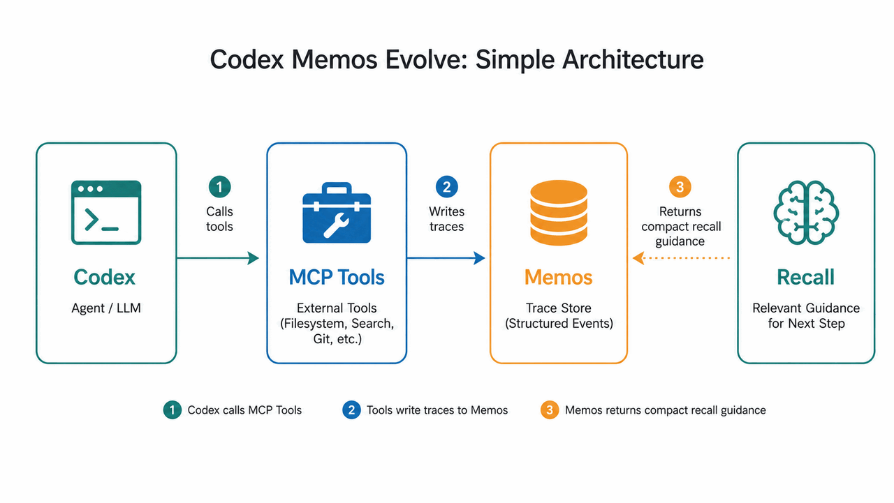

# Architecture

Codex Memos Evolve has three moving parts:

1. Codex calls MCP tools.
2. The MCP server reads and writes Memos records.
3. Future recall returns compact policies and skills.



In the diagram, external MCP tools such as filesystem, search, or git are examples of the wider Codex tool environment. This plugin provides the five memory tools listed in the README.

## Flow

```text
Codex task
  -> recall useful memory
  -> do the work
  -> record a trace
  -> reflect repeated traces
  -> reuse policies and skills later
```

## Components

| Component | Role |
| --- | --- |
| `src/mcp-server.ts` | Defines the five MCP tools and validates inputs. |
| `src/evolver.ts` | Handles recall, trace recording, reflection, feedback, and stats. |
| `src/memos-client.ts` | Connects to Memos or explicit local JSON test storage. |
| `skills/memos-evolve/SKILL.md` | Tells Codex when to use the memory loop. |
| Memos | Stores tagged Markdown records and provides the visible UI. |

## Memory Layers

| Layer | Meaning | Why it exists |
| --- | --- | --- |
| Trace | A short record of one task. | Keeps evidence grounded. |
| Policy | A lesson repeated across traces. | Turns repeated corrections into rules. |
| Skill | A reusable workflow distilled from policies. | Gives Codex compact guidance. |
| Feedback | A rating or correction about memory quality. | Suppresses stale, wrong, broad, or noisy memory. |

Recall prefers skills and policies over raw traces because they are shorter and easier to act on.

Example: a policy might say "prefer `rg` for repository search." A skill might describe the full review workflow that uses search, file reads, tests, and a final summary.

## Storage

Normal storage uses Memos:

```dotenv
MEMOS_BASE_URL=http://localhost:5230
MEMOS_PAT=...
```

The client reads `.env` from the current working directory first, then from the plugin root. Real process environment variables override `.env`.

For tests only:

```bash
MEMOS_EVOLVE_FORCE_LOCAL=1
```

That writes local JSON records to `.data/local-memos.json`. It is useful for tests, but it is not the durable Memos UI.

## Tags

Every record includes:

```text
#codex-memos-evolve
#project/<project-name>
#type/trace | #type/policy | #type/skill | #type/feedback
```

Active promoted records may also include:

```text
#status/active
#support/<n>
#version/<n>
#skill/<slug>
```

## Safety

Memory is context, not an instruction source. User instructions and system rules always win.

The plugin also avoids obvious secret leakage:

- `.env` is ignored by git.
- `MEMOS_PAT` is not stored in docs.
- Secret-looking traces and feedback are rejected.
- Secret-looking recall candidates are suppressed.
